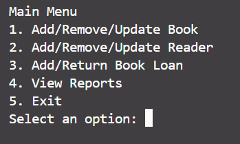
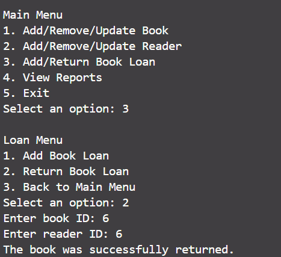
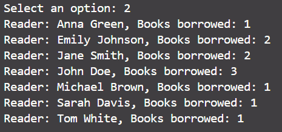

# BIT_test

# Скрипты для создания БД хранятся в папке db_scripts

# Включаем виртуальное окружение на unix:
source venv/bin/activate
#  Включаем виртуальное окружение на windows:
.venv\Scripts\Activate

# Установка зависимостей:
Перейти в каталог проекта, прописать команду: pip install -r requirements.txt
# Необходимо устновить свои данные для подключения в файле db_config.json

1. Запускаем проект python3 main.py
2. Можно увидеть основное меню

3. Попробуем использовать функции подменю

4. Для правильного взаимодействия с программой необходимо следовать ее советам(например, по вводу данных)

5. Файлы отчетности сохраняются в папку проекта - reports

